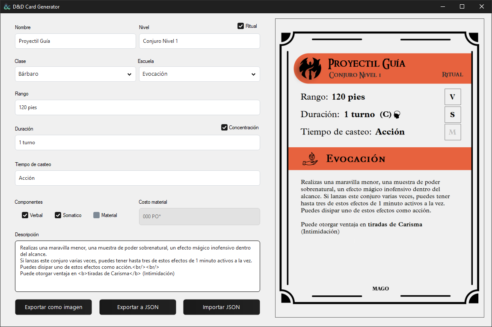
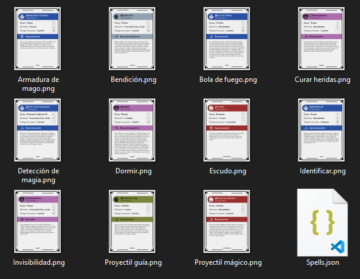

# 🧙‍♂️ D&D Spell Card Generator

A Windows Forms (.NET) desktop application that allows you to create customized **Dungeons & Dragons 5e spell cards** with a clean, printable design.  
You can generate individual cards or batch-export multiple spells from a JSON file as high-quality images.

---

## ✨ Features

- 🧪 **Visual editor** to easily create custom spell cards.
- 🖼️ **Live preview** of the final card as you fill in the fields.
- 📁 **Export to PNG** for each spell card, with styled formatting.
- 🔁 **Import/export in JSON** format for single or multiple spells.
- 📚 **Batch processing**: Import an entire array of spells and export them all at once.
- ✅ Customizable fields: name, class, level, school, casting time, duration, range, components, material cost, etc.
- 🎨 Automatically displays visual flags for **ritual** and **concentration** components.

---

## 🖥️ Screenshots

| Main interface | Exported cards folder |
|----------------|------------------------|
|  |  |

---

## 📦 JSON Format

To import multiple spells at once, use a `.json` file with the following structure:

```json
[
  {
    "name": "Proyectil Guía",
    "class": "Bárbaro",
    "duration": "1 turno",
    "level": "Conjuro Nivel 1",
    "range": "120 pies",
    "castingTime": "1 acción",
    "school": "Evocación",
    "description": "Realizas una maravilla menor, una muestra de poder sobrenatural...",
    "components": "VSMRC",
    "materialCost": "100 PO*"
  }
]
```

    🔤 components is a string that can include any of the following letters:

        V = Verbal

        S = Somatic

        M = Material

        R = Ritual

        C = Concentration

materialCost is optional and only used if the spell requires a material component with a cost.

---

## 📌 Possible Improvements

- Add dark/light themes and style presets
- Export cards as a combined PDF
- Design the reverse of the cards
- Localization support (English / Spanish)
- Add drag-and-drop JSON import

---

## 📄 License

This project is licensed under the MIT License. See the [LICENSE](LICENSE) file for details.

---

## 👤 Author

Made with ❤️ by [Nicolás Llamazares (Weby)](https://www.linkedin.com/in/llamazares-nicolas)  
Feel free to ⭐ star the repo or suggest improvements!
